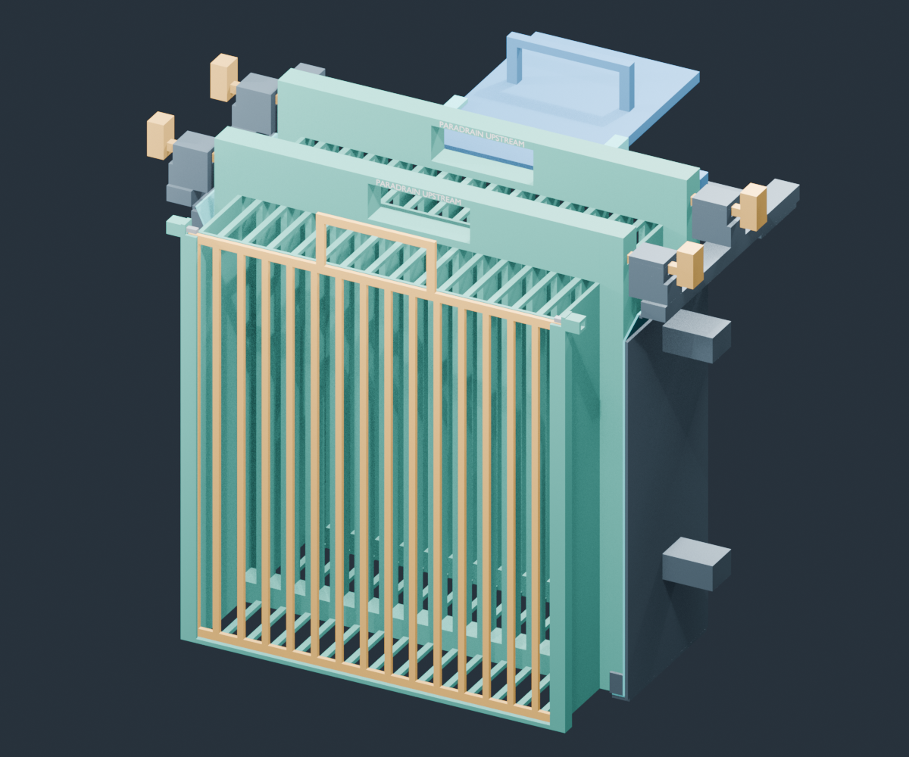

# ParaDrain

**Twin-basket drain filter · Final version 0.1 · Apache 2.0**

ParaDrain uses two identical, interchangeable debris baskets in a fixed frame. The upstream basket collects litter. During cleaning, it lifts out with the collected debris, and the backup basket moves forward into its place.

## Design

Each basket has a slotted rear screen, drained floor, side walls and slotted top. A shared front retainer closes the collection opening before lifting; two keeper pins secure it to the active basket.

Flared guides support insertion. A linked manual pusher moves the backup basket forward, and station bolts secure each basket in position. Both baskets carry **PARADRAIN UPSTREAM**, centered on the handle grip. They are interchangeable between positions and must retain their upstream orientation.

## Nominal specifications

| Parameter | Value |
|---|---:|
| Basket body, including keeper sleeves | 404 × 112 × 450 mm |
| Rear-screen interface | 400 × 25 × 450 mm |
| Station spacing | 120 mm |
| Clearance between basket bodies | 8 mm |
| Internal clear slots | 18 mm |
| Handle opening | 100 × 35 mm |
| Modeled lift assembly mass | 4.64 kg |

Dimensions are nominal. Mass excludes joints and reinforcement. See the [product specification](docs/specification.md) for materials, interfaces and qualification targets.

## Cleaning cycle

1. Fit the front retainer and engage both keeper pins.
2. Release the upstream basket's station bolts and lift the basket with its collected litter.
3. Move the backup basket forward with the manual pusher and secure it.
4. Hold the removed basket over a collection bin, release the retainer and empty it.
5. Return the cleaned basket to the rear position and secure it as the backup.

## Product documents and model

- [Product specification](docs/specification.md)
- [Technical design](docs/technical-design.md)
- [Editable Blender model](public/model/paradrain.blend)
- [Geometry and motion data](public/model/paradrain.json)
- [Validation and limitations](docs/validation.md)

## Qualification status

ParaDrain 0.1 is the final design with geometric and motion checks. Wet-litter retention, dirty-guide operation, finished hardware and handle strength, hydraulics, bypass and installation fit require physical testing. The rendered demonstration illustrates the cleaning sequence; it does not establish field performance.

## License

Original models, code, documentation and illustrations are available under the [Apache License 2.0](LICENSE). See [NOTICE](NOTICE) and [third-party notices](THIRD_PARTY_NOTICES.txt).
