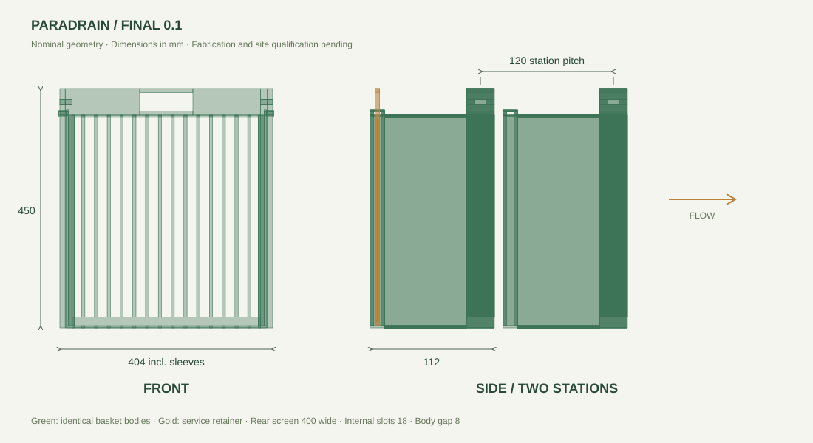

# Product specification — ParaDrain 0.1

Product: **ParaDrain**, twin-basket drain filter.

Package version: **0.1.0**. Date: **2026-09-13**. Status: **final version 0.1; physical qualification open**.

This document specifies the final ParaDrain 0.1 debris-carrying basket design. A modeled dimension is a nominal value, not a fabrication tolerance or tested performance rating.

## 1. Purpose and configuration

The product is a two-position debris filter for a suitable stormwater inlet or roadside drainage channel. The outer, upstream basket collects litter. The inner basket provides a standing backup while the outer basket is removed for cleaning. Both assemblies are identical, use the same guides and docking interfaces, and can occupy either position.

Each basket has a defined upstream face, marked **PARADRAIN UPSTREAM**, centered on the solid top handle grip. Interchangeability between slots is mandatory; front/back reversibility is not. The design intent is to retain screening coverage during servicing. Site sealing and actual hydraulic continuity remain to be demonstrated.

Fine sediment filtration, oil separation, powered transfer, automatic closure, spring assistance and vehicle wheel loading are outside this design.

## 2. Assembly and parts

| Assembly | Quantity | Function |
|---|---:|---|
| Basket body, FRP candidate | 2 | Rear screen, collection floor, side walls, slotted top, runners and retainer guides |
| Service retainer, FRP candidate | 1 | Shared accessory inserted into the active basket before removal |
| Basket keeper pins | 4 | Two per basket; obstruct upward retainer withdrawal |
| Fixed frame | 1 | Supports guides, station hardware and pusher |
| Polymer wear-strip set | 1 | Bottom bearing and side sliding surfaces |
| Flared guide-entrance set | 1 | Leads runners into the guide opening |
| Linked manual pusher | 1 | Contacts both rear stiles and advances the backup together |
| Pusher slider guide | 1 | Supports the central slider |
| Station docking bolts | 4 | Two per station, independently actuated |
| Docking-sleeve set | 1 | Supports the station bolts |

The 17 product mesh objects represent editable subassemblies, not a manufacturing parts count. Anchors, fabrication joints, reinforcement, final captive end-stops and keeper parking details are not resolved.

## 3. Nominal dimensions

Values below are generated from the shared product dataset. Axis X is width; positive Y is downstream; Z is up. The front rear-screen plane is centred at Y = 0, the rear at Y = 120 mm, and the seated basket top is Z = 0.

<!-- DIMENSIONS:START -->
| Parameter | Nominal value |
|---|---:|
| Rear-screen width | 400 mm |
| Basket height | 450 mm |
| Rear-screen depth | 25 mm |
| Body width including keeper sleeves | 404 mm |
| Full basket depth | 112 mm |
| Withdrawn keeper envelope width | 406 mm |
| Station centre spacing | 120 mm |
| Clearance between basket bodies | 8 mm |
| Internal clear slot | 18 mm |
| Running guide opening | 402 mm |
| Flared mouth opening | 430 mm |
| Main handle clear width | 100 mm |
| Main handle clear height | 35 mm |
<!-- DIMENSIONS:END -->

The rear screen contains fourteen 6 × 25 mm bars with a 380 mm screening height. Internal clear openings are 18 mm. Front-retainer, floor and top-cover ribs also have 18 mm internal spacing; edge clearances can be smaller. The retainer is 366 mm wide, 446 mm high and 4 mm deep in the concept geometry.

The 404 mm body width includes keeper sleeves above the guide-running region. The 400 mm rear-screen/runner interface remains unchanged. Withdrawn keeper tips reach 406 mm overall. This distinction matters when checking the flared entrance and service pockets.

The collection chamber is shallow: the full 112 mm depth includes the rear screen, channels and retaining plate. Gross envelope volume must not be advertised as usable litter capacity. Bulky or protruding litter can prevent closure even before a weight limit is reached.

## 4. Interfaces and movement

### Basket guides

The two baskets share continuous open guides. Nominal running inside width is 402 mm, giving 1 mm lateral clearance on each side of the 400 mm rear interface. Each runner is 10 mm wide and rests on a 12 mm wear strip. Guide mouths widen to 430 mm over a 30 mm rise, from Z = −100 to −70 mm.

Two 20 mm-high forward side stops limit upstream travel while leaving the new collection floor clear. The original full-width forward stop is removed. The rear stop remains. The 8 mm gap between basket bodies is a geometric fit only; trapped leaves, grit and deformation may consume it.

### Frame docking

Each station has two manual square sliding bolts. An 8 × 8 mm tongue enters a 10 × 10 mm port in the rear-screen side member at Z = −25 mm. Bolts withdraw 26 mm outward before basket motion. Engaged bolts geometrically obstruct lifting and streamwise displacement. Captive retention, positive parking and load resistance remain hardware qualification tasks.

### Service retainer and keepers

The retainer slides vertically into upstream channels and seats on the front floor member. Nominal clearance is 1 mm at each outer edge and 1.5 mm at each face. It is fitted only for servicing: an upstream screen left permanently in place would collect litter outside the chamber.

Each basket has two 18 × 5 × 4 mm concept keeper pins. A 10 mm outward stroke releases them. In the engaged position they sit above the retainer edge with approximately 1 mm vertical clearance; a 4 mm upward retainer movement is obstructed in the geometric check. Do not treat that check as an impact or strength rating. Final pin capture, finger controls and resistance to unintended withdrawal need design/testing.

### Transfer pusher

One rigid crosshead contacts both rear stiles. A broad central slider moves the backup 120 mm upstream. The front basket must be docked before the pusher resets. The pusher remains attached to the frame, and resets before an empty basket is lowered into the rear position. No spring is fitted.

## 5. Collection and service cycle

Normal flow enters an open upstream mouth. The rear screen, drained floor, side walls and slotted top form the collection chamber. The top cover addresses the large upward escape path that an open-topped chamber would leave for floating litter. Slots remain coarse; flexible and fine material can pass through them.

1. Bring the shared retainer. Lower it into the outer basket and engage both keeper pins.
2. Confirm closure, then withdraw both front docking bolts. Lift the basket vertically and carry it over a collection bin.
3. Withdraw the rear docking bolts. Advance the backup with the linked pusher, engage the front bolts, then reset the pusher.
4. With the removed basket over the bin, withdraw its keepers and lift out the retainer. Empty the basket manually.
5. Return the empty basket to the rear guides with the upstream face correctly oriented and the mouth open. Lower and dock it.
6. Retain the service accessory for the next cycle. Both baskets have exchanged roles.

One-operator servicing remains an ergonomic target. The design requires a shared accessory and multiple manual controls; it does not establish one-handed servicing, a tool-free operation, a specific holding method over the bin, or a proven service time. A blocked retainer is not a condition to overcome by forcing it closed. Define a safe alternative procedure in site qualification.

## 6. Materials and mass

The basket and retainer are provisionally modeled as glass-reinforced polymer at 1,900 kg/m³. Keeper pins are estimated at 7,850 kg/m³. These are calculation densities, not purchased material grades or lay-up specifications.

| Modeled item | Estimated mass |
|---|---:|
| Basket body | 4.2759 kg |
| Shared retainer | 0.3570 kg |
| Two keeper pins | 0.0057 kg |
| Lift assembly before captured litter | **4.6386 kg** |

Joints, reinforcement and final hardware are excluded. Finished empty mass ≤6 kg and loaded mass ≤14 kg remain acceptance targets. Determine wet retained-water and debris mass experimentally; do not infer a permissible litter volume by subtracting the modeled mass alone.

Fixed metalwork, polymer wear strips, fasteners and FRP require site-specific corrosion, wear, UV, creep, impact and stiffness selection. The concept meshes comprise touching closed shells; they are not fabrication-ready unions or laminate designs.

## 7. Qualification targets

These are inherited design targets or unresolved acceptance work, **not demonstrated ratings**.

| Topic | Target / required evidence |
|---|---|
| Capture and removal | Define the local litter set, then demonstrate capture, secured lift and emptying with wet, floating, flexible and protruding litter |
| Flow capacity | Clean assembly ≥90% of the unobstructed inlet capacity; test the revised floor, top and service retainer |
| Approach velocity | ≤0.75 m/s design target; establish the operating envelope |
| Head loss | Measure clean and 75%-blinded conditions; no value is specified yet |
| Bypass | Size against the surveyed inlet and design storm; the old 80%-blinding activation target has no implemented trigger |
| Basket stiffness | ≤3 mm mid-span deflection under the defined full hydrostatic load |
| Handle | Prove the specified 3× loaded-mass vertical-pull target and assess offset load balance |
| Docking and keepers | Demonstrate load resistance, capture, parking, dirty operation and resistance to unintended release |
| Guide operation | Measure breakaway, running and reset forces with wet litter, grit, wear, misalignment and the 8 mm body gap |
| Installation | Survey throat, sealing, overhead withdrawal space, control access, substrate and anchor pull-out |
| Exposure | Establish corrosion class, FRP lay-up/grade, UV, impact and service-life requirements |
| Maintenance | Prove single-operator handling and assess the former ≤60 s swap target; determine usable capacity and service interval |

The bypass is unresolved and is not part of the final product solids. The demonstration's water level, rainfall, floating-litter paths and emptying motion are illustrative. They must not be used to size a drain, select a design storm or claim flood protection. The unit has no vehicle wheel-load rating and needs a suitably rated installation arrangement wherever traffic exposure exists.

## 8. Evidence and change control

The authoritative geometry and canonical two-cycle animation are [the shared JSON dataset](../public/model/paradrain.json). The final Blender file is rebuilt from it, and the Three.js viewer reads it directly. [Validation notes](validation.md) identify deterministic checks and their limitations.

A change to basket geometry, orientation, station spacing, closure, latch or pusher interfaces requires a new design revision and renewed geometry/motion checks. Any performance claim also needs the corresponding physical evidence. Documentation and rendering changes may be maintained without implying a new mechanical design.
