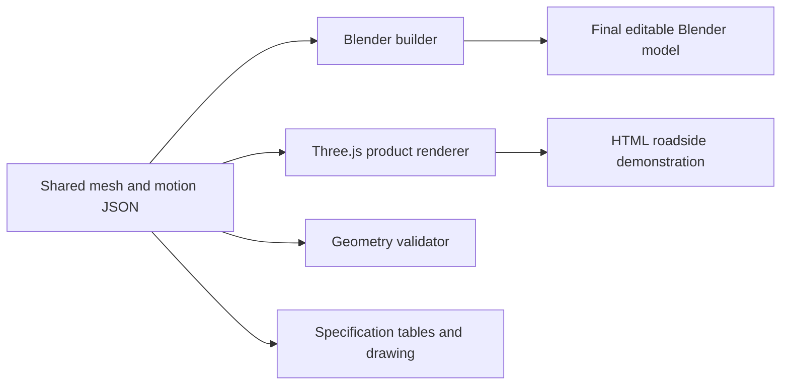

# Technical design and reproduction

## Architecture

The final product is one fixed guide-and-docking mechanism, two identical directional baskets and one shared service retainer. Collection geometry belongs to the removable basket; the linked transfer mechanism remains on the frame.

The floor supports captured litter. Side walls and the slotted top limit lateral and upward escape. The service retainer closes the upstream mouth before lifting. Together, these parts carry loose debris out with the basket.

A compression spring was considered for transfer but is not fitted. It would need measured wet/dirty resistance, a selected rate and preload, a reset strategy and controlled release. A manual pusher is the selected mechanism. No automatic retainer closure, interlocked release or single-handed actuation is claimed.

## One geometry source



`public/model/paradrain.json` contains exact exported component vertices, quad faces, component labels, materials, actor identities and location keyframes. Coordinates are metres with Z up and positive Y downstream. Basket A and Basket B reference the same mesh. Seventeen mesh objects represent the product; scenery and litter are separate.

The exported coordinates are rounded to nine decimal places in metres. Reopening the generated Blender file showed a maximum vertex difference below 0.000001 mm against the shared source. Component layout and source keyframes are preserved. The dataset is the final editable source, used by the standalone model builder. The public Blender project retains one Layout workspace and clears local file-browser paths.

## Blender

Run `blender/build.py` in a **background** Blender process, directly or through Blender MCP's CLI execution tool:

```python
import runpy
result = runpy.run_path('/path/to/project/blender/build.py', run_name='__main__')['result']
```

For direct command-line use: `blender --background --python blender/build.py`. Through Blender MCP CLI, the code above performs the same build in a separate process. The builder refuses to run inside an interactive session. It replaces only the background process's scene data and saves a normal project to `public/model/paradrain.blend`; the input file and interactive session are preserved. The output has one scene, a shared basket mesh, labelled upstream faces and a 1,008-frame, two-cycle canonical animation at 24 fps. Existing output at the canonical path is replaced when rebuilding.

Open the saved file, then execute `blender/verify.py` to compare actual mesh vertices, faces, component labels, shared meshes and all stored motion keyframes against the dataset. This is a deterministic data/geometry check, not an agent or LLM test.

## HTML demonstration

The application uses Three.js 0.186.0, Vite 8.3.0 and plain JavaScript. `src/product.js` constructs flat-shaded mesh triangles directly from the exported faces. It does not approximate the product with separately drawn boxes. `src/timeline.js` owns playback phases and interpolation; `src/scenario.js` owns the procedural roadside environment and illustrative litter.

The demonstration is a **34-second illustration**: an 8-second rainfall/collection introduction, the first canonical maintenance cycle, and a final hold. It shows one complete role exchange. The Blender file retains both canonical cycles.

For the roadside setting, free-space lift/carry heights and lateral holding positions are raised/moved to clear a bin standing on a maintenance apron. Product solids, guide engagement, docking ports, 120 mm transfer, keeper stroke and pusher reset are unchanged. Tests verify that the retainer and both keeper pins remain attached to the carried basket throughout the loaded portion. Adapted carry paths are presentation choices, not ergonomic validation.

Water uses a displaced plane, reflective material and moving surface streaks. Rain is a line-particle effect. Procedural leaves, wrappers and a small bottle follow predefined capture/emptying paths. There is no fluid, debris-contact, force or human-body simulation. The selected litter fits the chamber in the illustration; it does not represent the full local waste stream. The bin and raised basket imply manual support and emptying, not autonomous movement or an installed lifting device.

All environment textures are generated with deterministic canvas noise. No external image services, fonts, tracking, stock assets or runtime CDNs are required. The production build serves model data and application assets from the same origin. The scene uses WebGL 2, caps pixel ratio at 1.5, and provides a static inspection image/technical-guide fallback.

## Public package

`npm run package` runs deterministic checks, builds both HTML entry points, and creates a ZIP from an explicit allowlist. The archive includes source, model, documentation, evidence, licenses and the prebuilt `site/` folder. It excludes `.codex`, `.fab7`, `.local-archive`, caches, dependencies, browser traces and the parent workspace.

The root and served site retain the Apache license, project NOTICE and third-party notices. The Three.js runtime remains MIT-licensed. Vite and Playwright attribution is also retained. Original model geometry, scenery, code and documentation use Apache 2.0. Preparing an archive does not create or publish a remote repository.

## Research and confidence

- **Observed manufacturer precedent:** removable stormwater inlet baskets can be lifted and serviced. Oldcastle's brochure uses a shelf/top-entry arrangement; that does not validate this narrow side-entry architecture. [Inlet-filter brochure](https://oldcastleinfrastructure.com/wp-content/uploads/2019/05/Inlet-Filters-Brochure-OI_WEB.pdf).
- **Guide design context:** off-axis force and bearing arrangement can cause binding. A linked pusher applies a common stroke, but cannot prove dirt tolerance. [igus guide guidance](https://www.igus.ca/company/linear-guides-the-2-1-rule-ca).
- **Material context:** FRP provides a lower-density candidate, with different stiffness and construction requirements from steel. The custom basket still needs material/lay-up and load qualification. [Fibergrate design guide](https://www.fibergrate.com/fileshare/ProductFiles/design_guides/designguide.pdf).
- **Implementation reference:** geometry buffers, rendering, controls and color management follow the installed Three.js APIs. [Three.js documentation](https://threejs.org/docs/).

Confidence is high in the measured nominal geometry, mass arithmetic and deterministic motion checks. Confidence in wet-litter retention, closure effort, loaded handling, durability and hydraulic performance remains provisional. The [specification](specification.md) lists the physical work needed to resolve those questions.
